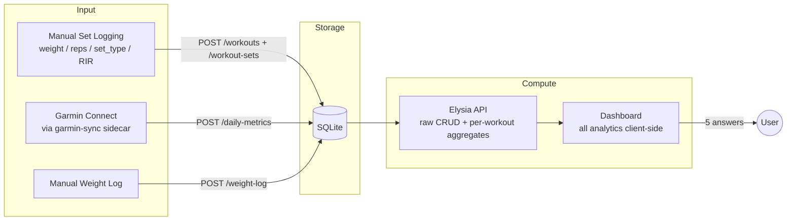

# Strength Tracker v2 — Analytics Reference

> **Analytics reference.** This document describes metric definitions, formulas, and composite signals — the _what_ and _why_. For implementation conventions (route structure, query factories, chart primitives), see `apps/dashboard/CLAUDE.md` and `.claude/rules/basalt-charts.md`.
>
> **Note:** The schema section references `SQLite` in flow diagrams. The API uses Postgres. Table definitions and metric formulas are otherwise current.

---

## Scope

This app tracks **the key compound lifts you want to get stronger at** — bench press, squat,
deadlift, weighted pull-ups today; extensible via the `exercises` reference table tomorrow (OHP,
front squat, RDL…). Isolation work and accessory exercises are not first-class citizens. Every
chart, hero card, and signal is designed around: _am I progressing on the lifts that matter?_

The app is greenfield — prior data is backed up separately, so schema changes don't need
migrations. Break things, iterate freely.

---

## Lessons carried over from Garmin Health

The Garmin Health page is the pattern reference. These are the specific learnings that shape every
decision below; if something here conflicts with Garmin Health, Garmin Health wins.

| Learning                                                                                            | Where it applies to strength                                                                          |
| --------------------------------------------------------------------------------------------------- | ----------------------------------------------------------------------------------------------------- |
| **One concept, one name** — hero label = section title = chart title.                               | "Strength Direction", "Training Load", "Readiness" — each used in exactly one place with one meaning. |
| **6-word subtitle per chart** — every `ChartCard` carries the question it answers.                  | "Am I getting stronger?", "Is my load sustainable?", "Am I loading smart?"                            |
| **Header extra on every chart** — today's reading + verdict in the card's top-right slot.           | Latest 1RM + momentum arrow, current weekly tonnage + zone, INOL of last session, etc.                |
| **Personal z-scores for dissimilar scales** — the Fitness Trends fix for RHR/HRV/VO2.               | Strength Composite plots 1RM-velocity, tonnage-growth, and INOL-quality on one σ axis.                |
| **EWMA > rolling mean** for training load (Hulin 2017).                                             | Acute 7d / chronic 28d tonnage drives the strength ACWR.                                              |
| **Dynamic personal ceilings** — p90 of your own history, not hardcoded thresholds.                  | MEV/MAV/MRV per exercise from p10/p50/p90 of your own weekly work-set count.                          |
| **MACD-style acute−chronic divergence**.                                                            | Weekly tonnage divergence histogram — reveals accumulation vs peaking phases.                         |
| **Fatigue-debt adjustment** on recovery (strain-debt analog).                                       | Yesterday's INOL and tonnage dampen today's "push" verdict.                                           |
| **Cross-chart hover sync** — basalt's shared cursor store, on by default.                           | Every chart on the page snaps to the same session date on hover.                                      |
| **Visx primitives only** — `CartesianChart`, `ChartCard`, `ChartLegend`, `ZonedLine`, `Bars`, `VX`. | No recharts. No raw hex. No `localStorage.getItem('theme')`.                                          |
| **Client-side analytics** — API returns raw rows, dashboard derives everything.                     | Iteration on formulas doesn't require an API deploy.                                                  |

---

## The 5 Questions This Dashboard Answers

| #   | Question                                         | Composite signal                                                           | Min data           | Wearable?                      |
| --- | ------------------------------------------------ | -------------------------------------------------------------------------- | ------------------ | ------------------------------ |
| 1   | Am I getting stronger on the lifts I care about? | **Strength Direction** — per-lift 3-level verdict from velocity + momentum | 4 weeks            | No                             |
| 2   | Am I loading smart or just hard?                 | **Load Quality** — INOL zones + fatigue-adjusted tonnage ACWR              | 2 weeks            | No                             |
| 3   | Are my lifts balanced?                           | **Balance** — DOTS-adjusted strength ratios against norms                  | 1 session per lift | No                             |
| 4   | Should I push, sustain, or deload _today_?       | **Readiness × Strain** — training state + physiological readiness          | 2 weeks            | Partial (better with wearable) |
| 5   | When should I deload?                            | **Deload Signal** — stall + fatigue + physiological confirmation           | 3 weeks            | Partial                        |

Every chart, badge, or number in the dashboard serves one of these five questions. If it doesn't,
it's not on the page.

---

## Part 1 — Data Architecture

### 1.1 Flow



### 1.2 Schema

Core tables — always available, manual input:

```sql
exercises
  id            TEXT PRIMARY KEY      -- "bench_press", "deadlift", "squat", "pull_ups"
  name          TEXT NOT NULL         -- "Bench Press"
  category      TEXT NOT NULL         -- "push" | "pull" | "legs" | "hinge"
  muscle_group  TEXT NOT NULL         -- "chest" | "back" | "quads" | "glutes" | "posterior"
  is_bodyweight INTEGER DEFAULT 0     -- 1 for pull-ups, dips, etc.
  display_order INTEGER               -- sort order in UI

workouts
  id            INTEGER PRIMARY KEY
  date          TEXT NOT NULL         -- YYYY-MM-DD
  exercise_id   TEXT NOT NULL → exercises(id)
  notes         TEXT
  rir           INTEGER               -- Reps in Reserve (0–5) for the TOP work set, optional
  created_at    TEXT

workout_sets
  id            INTEGER PRIMARY KEY
  workout_id    INTEGER NOT NULL → workouts(id) CASCADE
  set_number    INTEGER NOT NULL
  set_type      TEXT NOT NULL         -- "warmup" | "work" | "drop" | "amrap"
  weight_kg     REAL NOT NULL
  reps          INTEGER NOT NULL
```

Wearable tables — already shipped for Garmin Health, reused here:

- `daily_metrics` — body state (HRV, RHR, sleep, BB). Source of truth for readiness.
- `weight_log` — manual body weight entries. Falls back to nearest `daily_metrics.weight_kg` if
  not present; falls back to `user_profile` configured default.
- `user_profile` — height, gender, birthdate. Feeds DOTS normalization.

### 1.3 Design constraints

- **`exercises` is a reference table**, not a TS enum. Adding a new key lift is a row insert.
- **`rir` lives on `workouts`** (per session), not per set. Matches how lifters think ("that session
  was a top set at RIR 2"). Per-set RIR can be added later if needed — start simple.
- **`amrap` as a set_type** — the last set of a 5/3/1 or similar template, taken to near-failure.
  Counts as `work` for all aggregates but is flagged for e1RM estimation (see 2.2).
- **All analytics client-side.** API returns raw rows + a few per-workout aggregates that need the
  sets to compute (max weight, best-set e1RM, total volume). Everything else — derivatives, ACWR,
  ratios, readiness — is derived in the dashboard.
- **Body weight is dynamic.** `effective_weight(set, date) = is_bodyweight ? set.weight_kg +
bw(date) : set.weight_kg`, where `bw(date)` walks `weight_log → daily_metrics → profile default`
  in that order.
- **Null-safe everywhere.** RIR, body weight, and every wearable field can be null on any day.

---

## Part 2 — Metric Definitions

### 2.1 Stored metrics (per set, per workout)

| Field                  | Per     | Source                                           |
| ---------------------- | ------- | ------------------------------------------------ |
| `weight_kg`            | set     | UI                                               |
| `reps`                 | set     | UI                                               |
| `set_type`             | set     | UI (`warmup` / `work` / `drop` / `amrap`)        |
| `rir`                  | workout | UI (optional, 0–5)                               |
| `body_weight_kg(date)` | day     | `weight_log` → `daily_metrics` → profile default |

### 2.2 Estimated 1RM (the canonical strength measure)

Two formulas, averaged per set, with a strict rep gate. We **do not** trust e1RM from every set —
it is unstable at rep extremes.

```
Brzycki: e1RM = W × 36 / (37 − R)
Epley:   e1RM = W × (1 + R / 30)

Per-set score:  e1RM(set) = (Epley + Brzycki) / 2,  for R ∈ [1, 10]
                undefined (null) for R > 10

Eligibility:    set_type ∈ {work, amrap}  AND  R ∈ [1, 10]
```

Implemented by `estimate1RM` / `computeMetrics` in `apps/api/src/lib/formulas.ts`, which is the
single source of truth. `previewMetrics` in the dashboard's `workout-form.tsx` mirrors it so the
form's live preview and PR trophy agree with the achievement toast fired on save.

#### Why the gate is exactly 10 reps

Not a round number — it is the point where the two formulas **cross**. Setting them equal:

```
1 + R/30 = 36/(37 − R)
(30 + R)(37 − R) = 1080
R² − 7R − 30 = 0        →  R = 10   (positive root)
```

Their multipliers on either side of that root:

| Reps | Epley | Brzycki | Higher    |
| ---- | ----- | ------- | --------- |
| 1    | 1.033 | 1.000   | Epley     |
| 5    | 1.167 | 1.125   | Epley     |
| 8    | 1.267 | 1.241   | Epley     |
| 10   | 1.333 | 1.333   | identical |
| 12   | 1.400 | 1.440   | Brzycki   |

Below 10, Brzycki is consistently the conservative one and the two bracket each other — averaging
them is a genuine hedge, and they never differ by more than ~3 % (widest at R = 1). At exactly 10
they agree to the digit. Above 10 the ordering **flips**: Brzycki overtakes Epley and accelerates
toward its pole at R = 37, where it divides by zero. Past the crossover there is no longer a
bracket, so the answer depends entirely on which formula you picked — which is not an estimate, it
is a choice. We refuse rather than guess: a session whose only work sets are 11+ reps reports
`estimated_1rm: null`.

This is an **accuracy** gate, not a stability one — see the limitation below.

#### Best e1RM per workout = the best single set

```
best_e1RM(workout) = max( e1RM(set) )  over eligible sets
                     ties → the heavier set
```

Score each set, **then** take the winner. The reported `estimated_1rm_epley` and
`estimated_1rm_brzycki` are that winning set's own two components, so the average always sits
between them.

> **Historical bug (fixed).** An earlier `computeMetrics` took `max(Epley)` and `max(Brzycki)`
> across sets _independently_ and averaged the two maxima. When the maxima came from different sets
> the result described neither — and could exceed every individual set's estimate. For 132.5×1
> (Epley 136.9 / Brzycki 132.5 → 134.7) plus 100×10 (133.3 / 133.3 → 133.3) it reported **135.1**,
> higher than either set actually earned. Guarded by a regression test in `formulas.test.ts`.

#### Why not the alternatives

| Approach                                            | Verdict | Reason                                                                                                                                                                                                                                                       |
| --------------------------------------------------- | ------- | ------------------------------------------------------------------------------------------------------------------------------------------------------------------------------------------------------------------------------------------------------------ |
| **Max per-set** (chosen)                            | ✅      | Set-count invariant in practice — fatigue means the top work set usually wins anyway. Matches how Strong/Hevy report it.                                                                                                                                     |
| Average weight & reps, then one e1RM                | ❌      | Mathematically unsound. Feeding averaged reps into a nonlinear formula describes a set that never happened: 140×1 + 60×12 becomes "100×6.5".                                                                                                                 |
| Mean of per-set e1RMs                               | ❌      | Deflates with volume. Adding one back-off set to a 3-set session drops e1RM ~2 kg, so a programming change reads as a strength change.                                                                                                                       |
| Heaviest set only                                   | ❌      | Discards rep information. A heavy triple and a high-rep set at lower load can represent the same strength; taking only the bar weight loses that.                                                                                                            |
| Averaging more formulas (Wathan, Mayhew, Lombardi…) | ❌      | Ensemble averaging reduces variance only when model errors are independent. These are all fitted to the same assumption — one universal rep→1RM curve — so their errors correlate and little is gained, at the cost of a number no other tool can reproduce. |

**Why not Mayhew specifically?** Mayhew is tuned for the bench press and under-estimates for squat
and deadlift in untrained-to-intermediate populations. Brzycki+Epley has the widest published
validation across the three powerlifts (see references).

#### Known limitation — rep-scheme bias dominates

The choice of _combining rule_ above is worth ~2 kg. The formulas' own rep-scheme sensitivity is
worth an order of magnitude more. A heavy day of 105×3 scores **113.4**; a volume day of 95×10
scores **126.7** — same lifter, same week, **13 kg apart** — because the formulas assume one
universal rep→1RM curve that no individual actually follows.

No aggregation rule can fix this; it is upstream of the aggregation. Two consequences:

1. **Do not read session-to-session jitter as a strength change.** Stability belongs to the trend
   layer — the 30-day moving average and the 28-day regression in §3, not the per-session point.
2. **The real fix is RIR/RPE.** An 8 taken to failure and an 8 with three left in reserve are
   different lifts, and no rep-based formula can distinguish them.

> **Not yet implemented.** The RIR gate below is design intent, not current behaviour — the
> `workouts` table has no `rir` column, so nothing filters on it today. When added, the eligibility
> rule gains `AND (RIR is null OR RIR ≤ 3)` to stop sandbagged sets distorting the trend upward.

For bodyweight exercises: `W = weight_kg + body_weight(date)`. Pull-ups with no added weight are
still valid — they just have `weight_kg = 0`. Note this is why the Log Workout form shows no PR
trophy for pull-ups: the form has no bodyweight loaded, so it cannot reproduce the backend's score.

### 2.3 Single-session computed metrics

Derived from one workout's work sets.

> **Two rep windows, deliberately.** "Eligible" means different things depending on whether a
> formula is being _estimated_ or work is being _counted_:
>
> - **e1RM window — `work|amrap` and R ∈ [1, 10]** (§2.2). Bounded by formula validity.
> - **Load window — `work|amrap` and R ∈ [1, 12]**, used by INOL and the load metrics. An 11–12
>   rep set is real training work even where it is too high-rep to _estimate_ a 1RM from, so
>   excluding it would understate load.
>
> This is not drift between the two call sites — it is the intended split, and the code carries a
> comment at each boundary saying so.

```
max_weight       = max(work-set weights)                 over the LOAD window
total_volume     = Σ (effective_weight × reps)           over ALL sets (warmup + work + drop + amrap)
work_volume      = Σ (effective_weight × reps)           over the LOAD window
avg_intensity    = mean(effective_weight / best_e1RM)    over the LOAD window, as %
top_set_rir      = workout.rir                           (session RIR — not yet implemented, see §2.2)
```

**INOL (Intensity Number of Lifts)** — the single best single-number quality score:

```
INOL = Σ ( reps / (100 − %e1RM) )     over the LOAD window
where %e1RM = (effective_weight / best_e1RM) × 100, clamped to [40, 99]
```

INOL depends on `best_e1RM`, so a session with no set inside the **e1RM** window has no INOL
(`null`) even though its sets carry real load — intensity is meaningless without a 1RM reference.

The clamp prevents a singularity at 100% and rejects noise from very light back-off sets. INOL
zones (Hristov):

| INOL          | Zone        | Interpretation                          |
| ------------- | ----------- | --------------------------------------- |
| < 0.4         | Too light   | insufficient stimulus                   |
| 0.4 – 0.6     | Recovery    | deload / technique work                 |
| **0.6 – 1.0** | **Optimal** | **effective loading**                   |
| 1.0 – 1.5     | Hard        | sustainable short-term (peaking blocks) |
| > 1.5         | Excessive   | high fatigue risk, rarely appropriate   |

### 2.4 Relative strength (1RM / BW)

```
relative_strength(ex, date) = best_e1RM(ex, date) / body_weight(date)
```

This is the metric that survives weight change. A 100 kg bench at 80 kg BW (RS = 1.25) is more
impressive than 110 kg at 100 kg BW (RS = 1.10). Without it, "got stronger" and "got heavier" are
indistinguishable. `DOTS(ex, date)` extends this for balance ratios (2.8).

### 2.5 Time-series metrics (rolling windows over workout history)

**Moving average** — `MA(field, N)` = mean of the last N values of the given per-workout metric
for a given exercise. Min 3 valid points in window; otherwise null.

**EWMA** — same formula used in Garmin Health (Hulin 2017):

```
λ_acute   = 2 / (N_acute + 1)       N_acute   = 4  weekly points (≈ 4-week horizon)
λ_chronic = 2 / (N_chronic + 1)     N_chronic = 16 weekly points (≈ 4-month horizon)
ewma(t)   = load(t) × λ + ewma(t−1) × (1 − λ)
seed      = mean of first min(N, available) values
```

Load input is **weekly work_volume** for a given exercise (aggregated by ISO week, missing weeks
fill with 0). Smoothing N counts _weeks_, not days — the input is already a weekly series. This
avoids variance from the session cadence itself (2x vs 4x per week).

### 2.6 Velocity & Momentum (Kurvendiskussion)

Applied to `best_e1RM` time series, per exercise.

```
f'(t) = d(e1RM) / dt
  = slope of linear regression of e1RM over [t − 28d, t]
  in kg/day. Divide by e1RM to get %/day (preferred for cross-lift comparison).

f''(t) = d(f'(t)) / dt
  = slope of f'(t) over [t − 28d, t]
```

**Strength Direction** — 3-level verdict per lift (collapsed from a 5-level model, same reasoning
as Garmin Health's Fitness Direction collapse):

```
velocity_positive  = f'(t) > +0.10 %/day      (≈ +3% per month)
velocity_flat      = −0.05 ≤ f'(t) ≤ +0.10 %/day
velocity_negative  = f'(t) < −0.05 %/day

Improving (▲)  velocity_positive
Stable    (►)  velocity_flat
Declining (▼)  velocity_negative
```

f''(t) is surfaced as sub-text under the badge (e.g. "▲ Improving · accelerating" when f' > 0 and
f'' > 0; "▲ Improving · decelerating" when f' > 0 and f'' < 0). The finer 5-level classification
is kept as tooltip content but not as the primary signal, matching the Garmin Health rule that
users read "Improving ▲" and either trust it or not — degree belongs in the drill-down.

### 2.7 Tonnage ACWR — "training load" for strength

```
tonnage_week(ex)    = Σ total_volume(session)  over sessions in that ISO week (per exercise)
ewma_acute(ex, t)   = EWMA(N=4)  on tonnage_week   — 4-week horizon
ewma_chronic(ex, t) = EWMA(N=16) on tonnage_week   — 16-week horizon
ACWR(ex, t)         = ewma_acute / ewma_chronic
```

Zones identical to Garmin Health (Gabbett 2016):

| ACWR      | Zone         |
| --------- | ------------ |
| < 0.8     | Under-loaded |
| 0.8 – 1.3 | **Optimal**  |
| 1.3 – 1.5 | Caution      |
| > 1.5     | Danger       |

`divergence(ex, t) = ewma_acute − ewma_chronic` — rendered as a histogram below the ACWR line,
same MACD pattern as Garmin Health. Positive bars (green) = building load. Negative (red) = shed
load / deload phase. Sign change = inflection point worth tagging.

**Global training load** (across all key lifts) uses weekly **INOL-weighted tonnage**:

```
load_week = Σ (tonnage_week(ex) × clamp(INOL_avg(ex), 0.4, 1.5))
```

This prevents a junk-volume lift from inflating total load while an INOL-rich lift gets its due.

### 2.8 DOTS-adjusted strength ratios

Raw `1RM_deadlift / 1RM_squat` is noisy when body weight changes. DOTS normalizes to a
common bodyweight (IPF's 2020 replacement for Wilks). For our purposes:

```
DOTS(e1RM, bw, sex) = e1RM × dots_coeff(bw, sex)

ratio(A, B) = DOTS(e1RM_A, bw, sex) / DOTS(e1RM_B, bw, sex)
```

Normative ranges from 809,986 IPF entries (2024 meta-analysis):

| Ratio            | Expected range                | Notes                                                |
| ---------------- | ----------------------------- | ---------------------------------------------------- |
| Deadlift / Squat | 1.0 – 1.25                    | Squat-dominant → lower ratio; DL-specialist → higher |
| Squat / Bench    | 1.2 – 1.5                     | Below 1.2 = leg weakness signal                      |
| Deadlift / Bench | 1.5 – 2.0                     | Anything above 2.0 = unusual anterior-chain deficit  |
| Pull-up / BW     | 0.4 – 0.7 (added weight / BW) | As weighted pull-up ratio                            |

Status bands:

```
Balanced    ratio within expected range
Imbalanced  ratio outside range by > 15%
Critical    ratio outside range by > 30%
```

### 2.9 Personal volume landmarks (MEV / MAV / MRV)

Instead of hardcoded "10 sets per muscle group per week" (which doesn't match your training age or
responder phenotype), compute per-exercise landmarks from **your own** weekly tonnage history —
same pattern as the p90 strain-debt ceiling in Garmin Health.

```
tonnage_week(ex)  = Σ total_volume(session)  over sessions in that ISO week (90-day window)

MEV(ex) = p25(tonnage_week(ex))    minimum effective volume
MAV(ex) = p50(tonnage_week(ex))    maximum adaptive volume
MRV(ex) = p90(tonnage_week(ex))    maximum recoverable volume
```

Zone bands draw these three lines onto the weekly volume chart (in kg). Sitting in MEV–MAV for a
mesocycle = accumulation phase. Spiking to MRV = peaking. Falling below MEV for > 2 weeks with no
e1RM gain = detraining risk.

Fallback: weeks with zero tonnage are excluded from the window before percentiles are taken, so
cold-start data doesn't collapse the landmarks to zero.

### 2.10 Personal z-score composite (Strength Composite)

The three quality signals — velocity (%/day), weekly tonnage growth, and INOL — live on
incompatible scales. Plot them together without normalization and one dominates. Same problem we
solved in Fitness Trends with personal z-scores.

```
for each metric m ∈ {velocity, tonnage_growth, inol}:
  μ_m = mean(m)                    over personal 90-day window
  σ_m = sampleStdDev(m)            over personal 90-day window
  z_m = (m − μ_m) / max(σ_m, floor_m)

floors: velocity 0.05 %/day, tonnage_growth 0.02 (ratio), INOL 0.1
```

Rendered on a shared σ axis (−2σ … +2σ), 7-day MA per series, with raw values in the tooltip. The
dashed zero line is your own baseline. Same pattern as Fitness Trends — copy the implementation,
swap the inputs.

### 2.11 PR density

```
PR(ex, t) = e1RM(ex, t) > max(e1RM(ex, τ)) for all τ < t

pr_density_4w(ex) = count(PR(ex, t)) for t in last 28 days
pr_density_4w(total) = Σ pr_density_4w(ex)
```

PR density over time is a **mesocycle effectiveness** signal. Expected pattern: 0–2 PRs per
accumulation week, spike in the peaking week, zero in the deload. Flat zero for 4+ weeks = stall.

---

## Part 3 — Composite Signals

These combine the metrics above into the answers to the 5 questions.

### 3.1 Strength Direction (answer to Q1, per lift)

Already defined in 2.6. Per-lift 3-level verdict driven by f'(t) with f''(t) as drill-down.

### 3.2 Load Quality (answer to Q2, global)

```
load_quality =
  40% × inol_zone_score  +     -- how well is INOL sitting in 0.6–1.0
  40% × acwr_zone_score  +     -- how well is ACWR sitting in 0.8–1.3
  20% × volume_landmark_score  -- how well is weekly volume sitting in MEV–MAV

Each component: 100 if inside optimal zone, linearly falls off by distance.

verdict:
  ≥ 75   Quality   — training is effective and sustainable
  50–74  Adequate  — one component drifting, review drill-down
  < 50   Poor      — either junk-volume OR overload risk (check ACWR sign to disambiguate)
```

### 3.3 Balance (answer to Q3)

Per-pair ratio status from 2.8, aggregated:

```
Balanced when every DOTS-adjusted ratio is within expected range.
Imbalanced when any ratio is > 15% outside range.
Critical when any ratio is > 30% outside range.

Hero card displays the WORST status + the offending pair as sub-text.
```

### 3.4 Readiness × Strain (answer to Q4)

With wearable data — delegates to the Garmin Health Recovery Score (2.7 of `GARMIN-HEALTH.md`),
with an additional **fatigue-debt adjustment** specific to strength work:

```
fatigue_ceiling  = max(1.0, p90(inol_per_session))    personal strain-per-session ceiling
yesterday_inol   = INOL of most recent session within the last 48 h (null otherwise)
fatigue_debt     = clamp(0, 1, yesterday_inol / fatigue_ceiling)

readiness_strength = readiness_garmin × (1 − fatigue_debt × 0.25)      -- up to 25% shave
if yesterday_inol > 1.2:
  readiness_strength *= 0.9                                            -- extra 10% for heavy sessions
readiness_strength = clamp(0, 100, readiness_strength)
```

Same pattern as Garmin's strain-debt — the ceiling is personal, the max penalty is capped (25%
from fatigue debt, plus 10% extra when the last session was genuinely heavy), rest days don't
penalize. Strength fatigue can persist 48–72 h for heavy sessions, which is why the 48-h lookback
applies and heavy sessions get the additional dampening.

Without wearable data, the signal falls back to training-state detection:

```
PUSH verdict =
  strength_direction = Improving
  AND load_quality ≥ 75
  AND (yesterday was rest OR yesterday_inol < 0.6)
```

### 3.5 Deload Signal (answer to Q5)

Multi-signal, same architecture as the Garmin overtraining detector. Requires at least **two**
signals firing simultaneously to trigger — single-signal triggers produce too many false positives.

```
signals = {
  stall:    f'(e1RM) ≤ 0 for 3+ consecutive weeks on ≥ 2 key lifts
  overload: ACWR > 1.3 for 2+ consecutive weeks on ≥ 1 key lift
  fatigue:  avg INOL > 1.1 over last 10 sessions
  physio:   (requires wearable) Garmin Fitness Direction = Declining
            OR HRV 7d MA down > 15% vs 28d baseline
}

deload_verdict:
  count(active signals) ≥ 2  → "Deload recommended"
  count(active signals) = 1  → "Monitor — one stressor active"
  count(active signals) = 0  → "Progress mode"
```

Research consensus (PMC 2024 Delphi): deload every 4–8 weeks, ~1 week, reduce volume 40–50% while
holding 60–70% intensity. If the user has been in "Progress mode" for > 8 weeks, the hero card
prompts a proactive deload regardless of signal state.

---

## Part 4 — Visualisation Strategy

### 4.1 Layout

```
┌──────────────────────────────────────────────────────────────────────┐
│ FILTER BAR (date preset + active-lift chips + view toggle)           │
├──────────────────────────────────────────────────────────────────────┤
│ HERO ROW (3 composite cards — three-second read)                     │
│ [Strength ▲] [Load Quality 82 Quality] [Readiness 74 Push]           │
├──────────────────────────────────────────────────────────────────────┤
│ SECTION 1 · STRENGTH TRAJECTORY (50/50)                              │
│ [1RM Trend]                        [Strength Composite (σ)]          │
├──────────────────────────────────────────────────────────────────────┤
│ SECTION 2 · LOAD QUALITY (50/50)                                     │
│ [Weekly Volume (stacked)]          [Training Load (ACWR)]            │
├──────────────────────────────────────────────────────────────────────┤
│ SECTION 3 · EFFICIENCY & MOMENTUM (50/50)                            │
│ [INOL per Session]                 [Momentum (f' and f'')]            │
├──────────────────────────────────────────────────────────────────────┤
│ SECTION 4 · BALANCE (50/50)                                          │
│ [Relative Progression]             [Strength Ratios (DOTS)]          │
├──────────────────────────────────────────────────────────────────────┤
│ SECTION 5 · READINESS (wearable-only, 50/50)                         │
│ [Readiness × Strain]               [Training–Recovery Alignment]     │
└──────────────────────────────────────────────────────────────────────┘
```

Section ordering follows "cause → consequence" just like Garmin Health:

- Strength Trajectory: 1RM timeline (what's happening) → σ-composite (how broad the signal is)
- Load Quality: weekly volume (input) → ACWR ratio (response)
- Efficiency: INOL (quality score) → Momentum (curve analysis)
- Balance: relative progression (lifts vs themselves) → ratios (lifts vs each other)
- Readiness: recovery state (body) → alignment with training (match or mismatch)

Sidebar retains the **WorkoutForm** and **RecentRecords** from v1 — unchanged pattern, proven.
History view swaps Sections 1–5 for the workout list; it's not a separate page.

### 4.2 Naming rule (source of truth)

| Hero card    | Section               | Chart card title            | Header extra                                 |
| ------------ | --------------------- | --------------------------- | -------------------------------------------- |
| Strength     | Strength Trajectory   | 1RM Trend                   | Best e1RM (kg) + direction arrow             |
| —            | Strength Trajectory   | Strength Composite          | Today's σ score                              |
| Load Quality | Load Quality          | Weekly Volume               | Current week kg + MEV/MAV/MRV band indicator |
| —            | Load Quality          | Training Load (ACWR)        | Today's ratio + zone                         |
| —            | Efficiency & Momentum | INOL per Session            | Last session INOL + zone verdict             |
| —            | Efficiency & Momentum | Momentum                    | f'(t) (%/day) + f''(t) sign                  |
| —            | Balance               | Relative Progression        | Leader lift % · laggard lift %               |
| —            | Balance               | Strength Ratios             | Worst-offender pair + status                 |
| Readiness    | Readiness             | Readiness × Strain          | Today's score + verdict                      |
| —            | Readiness             | Training–Recovery Alignment | Today's alignment cell                       |

Section 1 reads "Strength Trajectory" both in the section header and in the hero card's
sub-text ("Strength · trajectory improving"). Users must never see two names for the same concept.

### 4.3 Subtitle rule (6-word FAQ)

Every `ChartCard` declares a `subtitle` prop — the question a user would ask.

| Chart                       | Subtitle                          |
| --------------------------- | --------------------------------- |
| 1RM Trend                   | "Am I getting stronger?"          |
| Strength Composite          | "Is the gain broad-based?"        |
| Weekly Volume               | "Am I progressively overloading?" |
| Training Load (ACWR)        | "Is my load spiking?"             |
| INOL per Session            | "Am I loading smart?"             |
| Momentum                    | "Where am I heading next?"        |
| Relative Progression        | "Which lifts are lagging?"        |
| Strength Ratios             | "Are my lifts balanced?"          |
| Readiness × Strain          | "Am I ready to push?"             |
| Training–Recovery Alignment | "Does today match my body?"       |

### 4.4 Cross-chart hover sync

Nothing to wire — the cursor is a module-level store shared by default. Hovering any chart
broadcasts the date, every other chart draws a ghost crosshair at the same session date. No
exceptions. No reimplementing closest-point loops inline; `ChartCursorScope` is the opt-out that
isolates a subtree.

### 4.5 Chart-specific treatments

| Chart                       | Visx kind                                            | Shape                                                                                                                                                                                                                                                                                                                                                                                  | Notes                                                                                                                                                               |
| --------------------------- | ---------------------------------------------------- | -------------------------------------------------------------------------------------------------------------------------------------------------------------------------------------------------------------------------------------------------------------------------------------------------------------------------------------------------------------------------------------- | ------------------------------------------------------------------------------------------------------------------------------------------------------------------- |
| 1RM Trend                   | `ZonedLine<T>` (existing)                            | Per-exercise lines with optional 30-day MA overlay (dashed). Reference line at best-ever e1RM per lift. PR dots appear after 1.5 s animation delay (preserve the v1 UX). When only one lift is active, line switches to theme-neutral grey (v1 convention); with multiple lifts, `VX.series.<exercise>` per-lift. Header extra shows the most recent e1RM for the primary active lift. | Hover shows best-set details ("120×6 @ RIR 2 → e1RM 143.9 kg").                                                                                                     |
| Strength Composite          | bespoke single-axis (z-score)                        | Three series — velocity z, tonnage-growth z, INOL z — on a shared σ axis in the style of Fitness Trends. 7d MA lines; raw values + σ reading in the tooltip. Dashed zero line = personal baseline.                                                                                                                                                                                     | One chart per active lift; when multiple lifts are active, page switches to "select one to view composite" placeholder (same as Fitness Trends' single-user model). |
| Weekly Volume               | `Bars<T>` (existing)                                 | Stacked bars: warmup (lightest) → work (primary) → drop (darker) → amrap (accent). Per-exercise grouped when multiple lifts active. MEV/MAV/MRV as three horizontal reference lines (dashed). 4-week MA as line overlay on left axis.                                                                                                                                                  | Uses the same `Bars` kind as Sleep Quality — grouped+stacked is supported.                                                                                          |
| Training Load (ACWR)        | `ZonedLine<T>` (existing)                            | 0.8/1.3/1.5 reference lines, optimal-zone band, threshold fills (green above 0.8, red above 1.3). Per-lift series with `highlighted` legend interaction dimming the others (shipped pattern).                                                                                                                                                                                          | Header extra: today's ratio + zone label.                                                                                                                           |
| INOL per Session            | `ZonedLine<T>` (existing)                            | Per-session dots (not a line — sessions are discrete events, connecting them implies continuity that doesn't exist). Optimal-zone band at 0.6–1.0. Dot color by zone (green/yellow/red). 10-session moving average line.                                                                                                                                                               | Header extra: last session's INOL + zone.                                                                                                                           |
| Momentum                    | bespoke dual-panel                                   | Top panel: 1RM with 4-week projection (dashed line extending from current f'(t) slope). Bottom panel: stacked histogram of f'(t) and f''(t), color-coded by sign. Green when both positive. `DualPanel` (two panes, one x scale) drives both panels — same pattern as `DivergenceChartInner` in Garmin Health.                                                                         | Per-lift — only one active at a time.                                                                                                                               |
| Relative Progression        | bespoke multi-line (possibly `ZonedLine` per series) | All active lifts normalized to 100% at filter-start date. Line chart showing % change over time. Legend-hover dims the others (shipped pattern).                                                                                                                                                                                                                                       | Reveals which lift advanced, which is stuck, independent of absolute numbers.                                                                                       |
| Strength Ratios             | bespoke horizontal Bars                              | One bar per pair (DL/Squat, Squat/Bench, DL/Bench). Normative range as green band. Current value as colored tick. Status label as header-extra (e.g. "DL/Bench critical · 2.3").                                                                                                                                                                                                       | Updates when body weight or e1RMs change. DOTS-adjusted.                                                                                                            |
| Readiness × Strain          | `ZonedLine<T>` (reuse Garmin's recovery chart)       | Push/Normal/Rest zone bands, threshold fill, strain-debt annotation dot when > 0.25.                                                                                                                                                                                                                                                                                                   | Wearable-only. Hidden when no Garmin data present (same pattern as Garmin Health's hasHeartData guard).                                                             |
| Training–Recovery Alignment | bespoke 3×3 matrix                                   | Recovery row × ACWR col: rows = High (≥70) / Normal (40–69) / Low (<40); cols = ACWR Under (<0.8) / Optimal (0.8–1.3) / Caution+ (>1.3). Each cell shows the verdict copy (Aligned / Misaligned / Risk) with session count; today's cell gets a colored border. Cell tooltip lists the last 8 session dates.                                                                           | Teaches the user which combinations they tend to end up in — surfaces "Heavy on low-recovery day" as a visible pattern.                                             |

### 4.6 Sparkline grid (alternate view)

Compact per-lift summary — toggled from the filter bar, replaces Sections 1–5:

```
┌──────────┬──────────┬──────────┬──────────┬──────────┬────────┐
│ Exercise │ 1RM      │ Volume   │ INOL     │ Momentum │ Status │
├──────────┼──────────┼──────────┼──────────┼──────────┼────────┤
│ Bench    │ ~~~~/~~  │ ~~~/~~~  │ ~~.~~~~  │ ▲  +8%   │ green  │
│ Squat    │ ~~~~//// │ ~~~/~~~  │ ~~.~~~~  │ ▲▲ +14%  │ green  │
│ Deadlift │ ~~~~~~~~ │ ~~~\~~~  │ ~~.~~~~  │ ►   0%   │ yellow │
│ Pull-ups │ ~~~~\~~~ │ ~~~\~~~  │ ~~.~~~~  │ ▼  −3%   │ red    │
└──────────┴──────────┴──────────┴──────────┴──────────┴────────┘
```

Generic sparkline primitives live under `src/charts/sparklines/` (currently `LineSparkline`,
`BarSparkline`). The strength-tracker grid that consumes them is at
`src/pages/strength-tracker/sparkline-grid.tsx` — an AntD `Table` composing the primitives per row.
Sparklines are exempt from the Legend/Tooltip contract (see visx rules) but still must use VX
tokens and `useVxTheme`. Each sparkline is < 60 px tall.

---

## Part 5 — Tier system

| Tier                | Content                          | Purpose                                       |
| ------------------- | -------------------------------- | --------------------------------------------- |
| Tier 1 — Answers    | 3 hero cards                     | Three-second read                             |
| Tier 2 — Evidence   | 10 charts across 5 sections      | Data behind the answers                       |
| Tier 3 — Drill-down | Tooltip + header-extra per chart | Per-date values, per-set details on 1RM chart |
| Tier 4 — Raw        | Sparkline grid + History view    | Dense scan / session-level edit               |

Reading flow: answer → evidence → detail → raw. Matches Garmin Health exactly.

---

## Part 6 — What stays from v1, what changes

### Stays

- Manual set-level logging (weight / reps / set_type) — the core input pattern.
- SQLite + Drizzle + Elysia + Refine v5 stack.
- Brzycki + Epley 1RM estimation (Mayhew dropped — see 2.2).
- PR detection with 1.5 s fade-in animation on the 1RM chart.
- Auto-load last session in the workout form.
- WorkoutForm + RecentRecords sidebar layout.
- Filter bar: date presets, active-lift chips, demo-data toggle, reset.
- `useLocalState` + `ST_KEYS` for persisted preferences.

### Changes

| v1                                                    | v2                                                          | Why                                                  |
| ----------------------------------------------------- | ----------------------------------------------------------- | ---------------------------------------------------- |
| 4 hardcoded exercises                                 | `exercises` reference table + `exercise_id` FK              | Add lifts without code                               |
| No RIR                                                | RIR on `workouts`, feeds e1RM validity gate                 | Reject sandbagged sets                               |
| Mayhew in e1RM average                                | Dropped, Brzycki+Epley only                                 | Mayhew over-fits bench                               |
| No INOL                                               | INOL per workout, zone-classified                           | Distinguishes quality from junk volume               |
| No derivatives                                        | f'(t) and f''(t) per lift                                   | Answers "where am I heading"                         |
| Recharts                                              | Visx primitives (`ZonedLine`, `Bars`, bespoke)              | One chart library, one tooltip contract              |
| `TOOLTIP_STYLE` hard-coded rgba                       | `CartesianChart`'s derived tooltip + `useVxTheme`           | Theme-reactive                                       |
| Hardcoded `PULL_UPS_BODYWEIGHT = 70`                  | Dynamic `body_weight(date)`                                 | Accurate when BW changes                             |
| `EXERCISE_COLORS` with raw hex                        | `VX.series.<exercise>` tokens                               | Palette hygiene                                      |
| Dual-axis metric selector (MainChart "left vs right") | Dropped — replaced by dedicated charts with clear questions | "Pick any two metrics" was flexible but insight-poor |
| `AreaMetricChart` (stacked area of any metric)        | Dropped — replaced by Weekly Volume (stacked `Bars`)        | Clearer semantic: volume is the thing you stack      |
| `FrequencyChart`                                      | Folded into Weekly Volume tooltip rows                      | Free up section space                                |
| No training state                                     | Strength Direction + Load Quality + Deload Signal           | Hero-level verdicts, not just charts                 |
| No balance analysis                                   | DOTS-adjusted ratio chart + relative progression            | Compares lifts fairly across BW changes              |
| No readiness integration                              | Readiness × Strain + Alignment matrix                       | Connects wearable data to training decisions         |
| No volume landmarks                                   | Personal MEV/MAV/MRV from p25/p50/p90                       | "Am I in the right volume range for me"              |
| No PR density                                         | PR count per 4-week block in hero drill-down                | Mesocycle effectiveness signal                       |

---

## References

| Source                               | Contribution                                                                                                         |
| ------------------------------------ | -------------------------------------------------------------------------------------------------------------------- |
| Brzycki (1993), Epley — NSCA Journal | 1RM estimation formulas                                                                                              |
| Hristov — INOL framework             | Load-quality scoring                                                                                                 |
| Hulin et al. (2017) — BJSM           | EWMA acute:chronic workload                                                                                          |
| Gabbett (2016) — BJSM                | ACWR zone thresholds                                                                                                 |
| IPF (2020) — DOTS coefficient        | Bodyweight-normalized strength comparison                                                                            |
| Schoenfeld et al. (2024) — JSCR      | Volume-hypertrophy dose-response                                                                                     |
| Israetel — RP Strength (2023)        | Volume landmarks framework (MEV/MAV/MRV)                                                                             |
| Helms et al. (2023) — MASS Review    | RIR methodology and accuracy                                                                                         |
| Nature Sci Reports (2025)            | HRV-guided training readiness                                                                                        |
| PMC Delphi study (2024)              | Deload timing consensus (every 4–8 weeks)                                                                            |
| PubMed (2024) — 809,986 entries      | Normative powerlifting strength ratios                                                                               |
| Garmin Health dashboard (this repo)  | Composite-card layout, primitive contract, z-score normalization, strain-debt adjustment, naming rule, subtitle rule |
